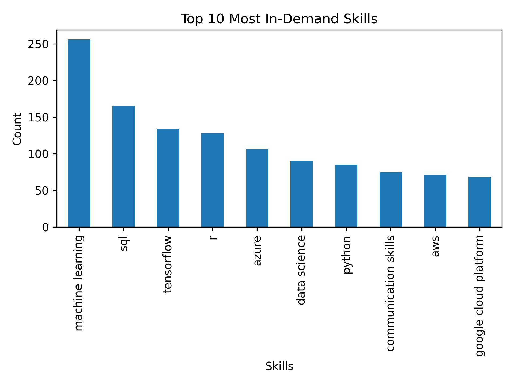
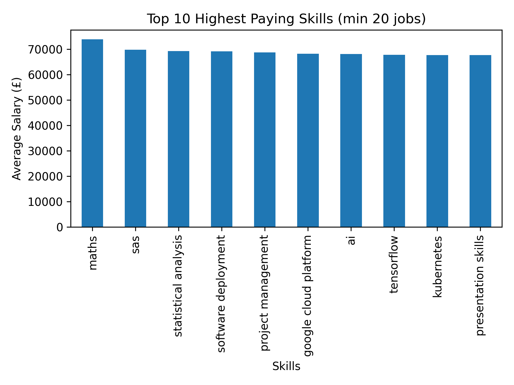
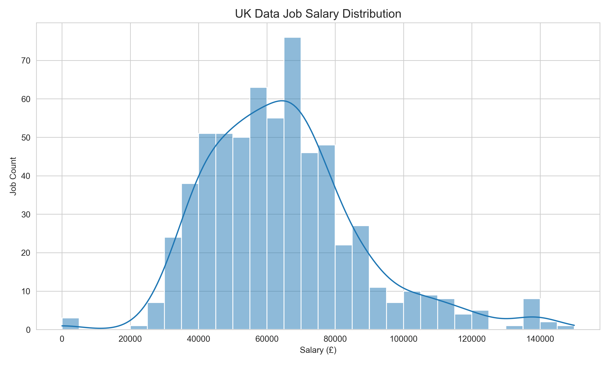
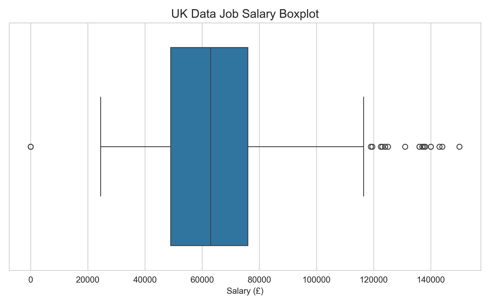
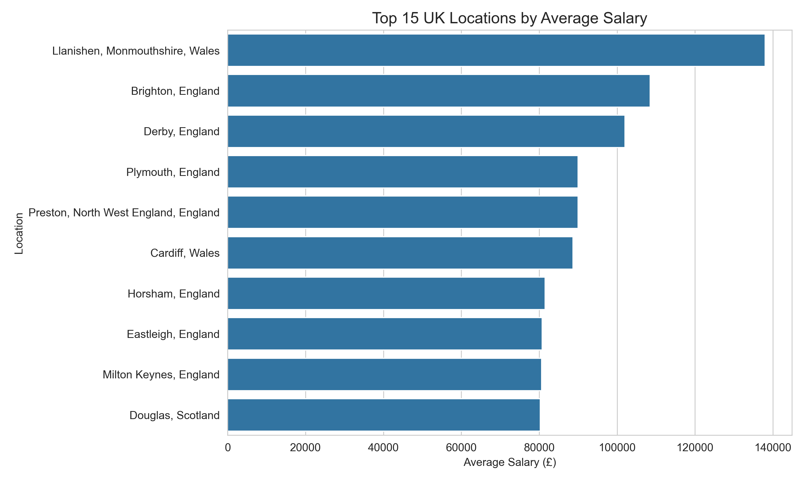
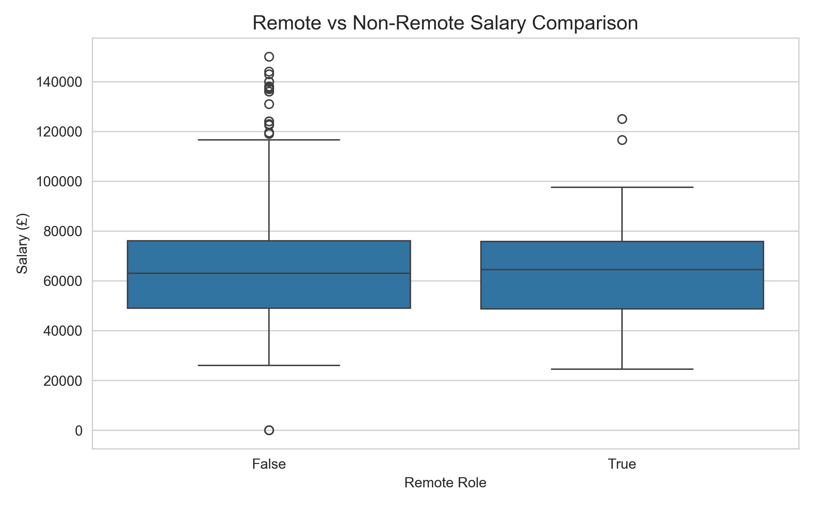
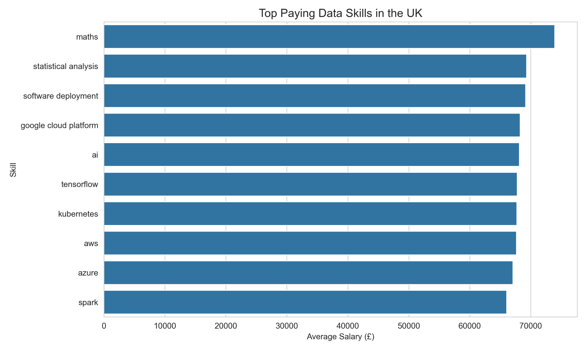
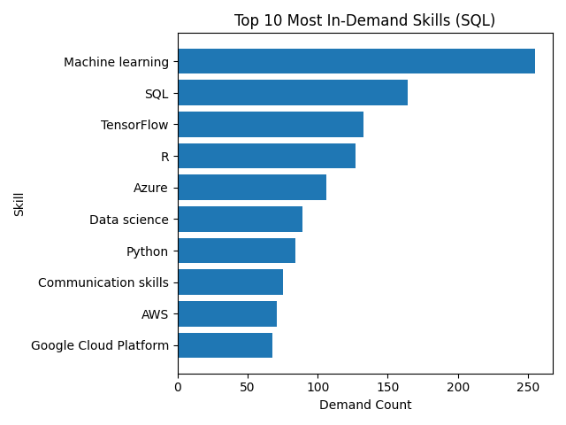

# UK Data Job Market Analysis – End-to-End Data Analytics Project

## Project Overview
This project analyzes UK data-related job postings to uncover hiring trends, salary distribution, skill demand, and compensation patterns.

The analysis was performed across three layers:
### Python 
- Data cleaning & exploratory analysis
### SQL (SQLite) 
- Structured analytical queries
### Power BI
- Interactive business dashboard

## Data Source
- Kaggle: UK Data Scientist Job Roles dataset  
- 750 job postings with company, role, location, salary, posting age, and skills

## Tools & Libraries
- Python (pandas, matplotlib)
- SQLite
- Power BI
- Git & GitHub

## Project Structure
uk_data_job_market_analysis/
│
├── data/
│   └── uk_data_jobs_raw.csv
│
├── src/
│   ├── analysis.py
│   ├── sql_setup.py
│   ├── sql_queries.py
│   └── main.py
│
├── output/
│   └── cleaned_uk_data_jobs.csv
│   └── job_skills_table.csv
│   └── job_table.csv
│
├── powerbi/
│   └── uk_data_job_analysis_powerbi.pbix
│
├── screenshots/
│   ├── top_10_skills.png
│   ├── top_paying_skills.png
│   ├── salary_distribution.png
│   ├── salary_boxplot.png
│   ├── salary_by_location.png
│   ├── remote_vs_nonremote.png
│   ├── skills_vs_salary.png
│   ├── top_skills_sql.png
│   └── powerbi_dashboard_overview.png
│
└── data_jobs.db
└── .gitignore
└── README.md

## Methodology
### Python - Data Cleaning & EDA
- Data loading and validation
- String cleaning and normalization
- Feature engineering (days since posted, salary bands)
- Salary parsing (hourly vs yearly, ranges)
- Aggregation with minimum job-count filtering
- Skill extraction and frequency analysis
- Visualization of demand trends

### SQL - Database & Analytical Queries
Data was structured into SQLite tables:
- jobs
- job_skills
Key SQL analyses performed:
- Average salary per skill
- Remote vs non-remote salary comparison
- Top-paying job titles
- Top in-demand skills
- Highest-paying skill Visualization

### Power BI -Interactive Dashboard
The final Power BI dashboard integrates cleaned and structured data to visualize:
1. KPI Cards:
- Average Salary 
- Total Jobs Distinct
- Skills Count
2. Bar Chart
- Top 10 Most In-Demand Skills
- Top Paying Job Titles
3. Skill vs Salary Scatter Plot

## Key Insights
- Machine Learning roles dominate hiring volume
- London remains the highest-paying job hub
- Cloud platforms (AWS, Azure, GCP) command premium salaries
- Statistical & analytical depth increases compensation
- Remote roles show competitive but variable salary distribution
- Python alone is common — domain specialization drives salary growth

## Visualization
### Top 10 Most In-Demand Skills

### Top 10 Highest Paying Skills (min 20 jobs)

### UK Data Job Salary Distribution

### UK Data Job Salary Boxplot

### Top 15 UK Locations by Average Salary

### Remote vs Non-Remote Salary Comparison

### Top Paying Data Skills in the UK (min 30 jobs)

### Top In-Demand Skills SQL

### PowerBI Dashboard

